# 🚀 本地提示词管理软件

> 一款高效的本地AI提示词管理工具，支持全局快捷键、实时AI对话、智能文本处理

[](https://www.python.org/downloads/)
[](https://opensource.org/licenses/MIT)
[](./tests/)
[](./docs/USER_GUIDE.md#性能)

## 📋 目录

- [✨ 功能特性](#-功能特性)
- [🎯 快速开始](#-快速开始)
- [⚙️ 配置指南](#️-配置指南)
- [🎮 使用方法](#-使用方法)
- [🏗️ 项目架构](#️-项目架构)
- [🧪 测试与开发](#-测试与开发)
- [❓ 常见问题](#-常见问题)
- [📖 详细文档](#-详细文档)

## ✨ 功能特性

### 🎯 核心功能

- **🔥 全局快捷键**：`Ctrl+Alt+Cmd+1-9` 一键触发AI处理
- **⚡ 极速响应**：快捷键响应时间 < 1ms，远超预期目标
- **🤖 多AI模型**：支持 Deepseek、Kimi 等主流AI服务
- **📝 智能模板**：Markdown模板 + YAML配置，灵活强大
- **🎨 实时输出**：流式输出直接插入到光标位置
- **🔧 热重载配置**：配置修改立即生效，无需重启

### 🌟 高级特性

- **🎪 智能文本选择**：自动识别并处理选中文本
- **🛡️ 字符过滤**：智能过滤特殊字符，确保输出安全
- **📊 性能监控**：实时监控响应时间和性能指标
- **🔄 自动重试**：网络异常时自动重试，提高成功率
- **💾 智能缓存**：模板预加载，配置缓存优化
- **🌍 跨平台**：完美支持 macOS、Windows、Linux

### 📈 性能表现

| 指标 | 表现 | 备注 |
|------|------|------|
| 快捷键响应时间 | < 1ms | 远超500ms目标 |
| 模板加载速度 | < 10ms | 预加载优化 |
| AI响应延迟 | 500ms-2s | 取决于网络和AI服务 |
| 内存占用 | < 50MB | 轻量级设计 |
| CPU占用 | < 1% | 后台静默运行 |

## 🎯 快速开始

### 📋 系统要求

- **Python**: 3.8+ 
- **操作系统**: macOS 10.14+, Windows 10+, Linux (Ubuntu 18.04+)
- **依赖管理**: [uv](https://github.com/astral-sh/uv) (推荐) 或 pip

### 🚀 一键安装

```bash
# 1. 克隆项目
git clone https://github.com/your-username/prompt_go.git
cd prompt_go

# 2. 安装依赖 (推荐使用 uv)
uv sync

# 或使用 pip
# pip install -r requirements.txt

# 3. 复制配置文件
cp config/global_config.example.yaml config/global_config.yaml
cp config/hotkey_mapping.example.yaml config/hotkey_mapping.yaml

# 4. 配置API密钥 (必须)
vi config/global_config.yaml  # 编辑API配置

# 5. 启动程序
uv run python main.py
```

### ⚡ 5分钟体验

1. **获取API密钥**
   - [Deepseek API](https://platform.deepseek.com/) 
   - [Kimi API](https://platform.moonshot.cn/)

2. **配置密钥**
   ```yaml
   # config/global_config.yaml
   api:
     deepseek:
       key: 'sk-your-deepseek-key'
       model: deepseek-chat
   ```

3. **启动使用**
   ```bash
   uv run python main.py
   ```

4. **测试功能**
   - 选中任意文本
   - 按 `Ctrl+Alt+Cmd+1` 
   - 查看AI总结结果！

## ⚙️ 配置指南

### 📁 配置文件结构

```
config/
├── global_config.yaml          # 主配置文件
├── hotkey_mapping.yaml         # 快捷键映射
├── global_config.example.yaml  # 配置模板
└── hotkey_mapping.example.yaml # 快捷键模板
```

### 🔧 基础配置

<details>
<summary>点击展开基础配置示例</summary>

```yaml
# config/global_config.yaml
api:
  deepseek:
    base_url: https://api.deepseek.com
    key: 'sk-your-deepseek-api-key'
    model: deepseek-chat
  
  kimi:
    base_url: https://api.moonshot.cn
    key: 'sk-your-kimi-api-key'
    model: moonshot-v1-8k

logging:
  level: INFO
  file: prompt_manager.log
  max_size: 10485760  # 10MB
  backup_count: 5

performance:
  typing_speed: 0.005
  hotkey_response_timeout: 0.5
  template_cache_enabled: true
```
</details>

### ⌨️ 快捷键配置

> **2024.07 新特性：支持任意自定义快捷键格式！**
>
> 你可以自由设置如 `ctrl+1`、`alt+shift+q`、`cmd+f5`、`ctrl+alt+z`、`ctrl+shift+space` 等组合，无需再局限于 `ctrl+alt+cmd+数字`。
>
> - 支持多修饰键（ctrl/alt/cmd/shift）+任意主键（字母、数字、F1-F24、特殊键等）
> - 自动检测冲突和格式错误
> - 配置修改后**无需重启**，热重载立即生效

<details>
<summary>自定义快捷键配置示例</summary>

```yaml
# config/hotkey_mapping.yaml
hotkeys:
  ctrl+1: grammar_check.md
  alt+shift+q: summarize.md
  cmd+f5: translate.md
  ctrl+alt+z: custom_template.md
  ctrl+shift+space: brainstorm.md
settings:
  enabled: true
  response_delay: 100
```
</details>

#### 使用说明

1. **编辑 `config/hotkey_mapping.yaml`**，添加你喜欢的快捷键组合
2. **保存文件**，程序会自动热重载，无需重启
3. **在任意应用中选中文本，按下你配置的快捷键**，即可触发对应AI模板处理

> ⚠️ 建议避免与常用系统/应用快捷键冲突（如 `cmd+c`、`cmd+v`、`ctrl+z` 等）

---

## 🎮 使用方法

### 🎯 基本工作流

1. **📝 选择文本** - 在任意应用中选中需要处理的文本
2. **⌨️ 按快捷键** - 使用预设的快捷键组合
3. **🤖 AI处理** - 系统自动调用AI进行处理
4. **📋 获得结果** - 处理结果直接插入到光标位置

### 🎨 模板定制

创建自定义模板非常简单：

```markdown
---
# prompt/custom_template.md
name: "代码审查"
description: "审查和优化代码"
model: "deepseek"
max_tokens: 2000
temperature: 0.3
---

请审查以下代码，并提供改进建议：

```{{language}}
{{text}}
```

请从以下方面进行分析：
1. 代码质量和可读性
2. 性能优化建议
3. 安全性考虑
4. 最佳实践建议
```

### 🔧 高级用法

<details>
<summary>性能优化模式</summary>

```yaml
# 高性能配置
performance:
  typing_speed: 0.002      # 极速打字
  chunk_output_delay: 0.005 # 最小延迟
  timeout: 10              # 快速超时
  preload_templates: true  # 预加载模板
  template_cache_size: 100 # 大缓存
```
</details>

<details>
<summary>多模型切换</summary>

```yaml
# 智能模型选择
model_selection:
  default: deepseek
  fallback_order: [deepseek, kimi]
  
task_routing:
  summarize: deepseek    # 总结用deepseek
  translate: kimi        # 翻译用kimi
  code_review: deepseek  # 代码审查用deepseek
```
</details>

## 🏗️ 项目架构

### 📦 模块结构

```
prompt_go/
├── main.py                 # 🎯 主程序入口
├── modules/               # 📚 核心功能模块
│   ├── config_manager.py     # ⚙️ 配置管理
│   ├── template_parser.py    # 📝 模板解析
│   ├── model_client.py       # 🤖 AI客户端
│   ├── hotkey_listener.py    # ⌨️ 快捷键监听
│   ├── text_processor.py     # 📄 文本处理
│   └── performance_optimizer.py # ⚡ 性能优化
├── config/                # 🔧 配置文件
├── prompt/               # 📝 模板文件
├── tests/                # 🧪 测试套件
└── docs/                 # 📖 文档
```

### 🔄 工作流程

```mermaid
graph LR
    A[用户按快捷键] --> B[快捷键监听器]
    B --> C[获取选中文本]
    C --> D[加载模板]
    D --> E[模板解析]
    E --> F[调用AI接口]
    F --> G[流式输出]
    G --> H[插入到光标位置]
```



### 🧩 核心组件

| 组件 | 功能 | 特性 |
|------|------|------|
| **ConfigManager** | 配置管理 | YAML解析、热重载、验证 |
| **TemplateParser** | 模板解析 | Markdown+YAML、占位符替换 |
| **ModelClient** | AI接口 | 多模型支持、流式输出、重试 |
| **HotkeyListener** | 快捷键监听 | 全局监听、冲突检测、跨平台 |
| **TextProcessor** | 文本处理 | 智能选择、字符过滤、插入 |
| **PerformanceOptimizer** | 性能优化 | 缓存、预加载、监控 |

## 🧪 测试与开发

### 🔍 运行测试

```bash
# 运行所有测试
uv run pytest

# 运行特定测试
uv run pytest tests/test_main.py -v

# 运行性能测试
uv run pytest tests/test_e2e_performance.py -k performance

# 生成覆盖率报告
uv run pytest --cov=modules --cov-report=html
```

### 📊 测试统计

- **总测试数**: 234个
- **通过率**: 95.7% (224通过, 7失败, 3跳过)
- **代码覆盖率**: 53% (核心模块>70%)
- **性能基准**: 快捷键响应 < 1ms ✅

### 🛠️ 开发指南

<details>
<summary>添加新模板</summary>

1. 在 `prompt/` 目录创建 `.md` 文件
2. 添加YAML前置配置
3. 在 `config/hotkey_mapping.yaml` 配置快捷键
4. 重启程序或等待热重载
</details>

<details>
<summary>添加新AI模型</summary>

1. 在 `modules/model_client.py` 添加客户端类
2. 实现 `ModelClient` 接口
3. 在 `ModelClientFactory` 注册
4. 在配置文件中添加API配置
</details>

## ❓ 常见问题

### 🔧 安装与配置

<details>
<summary><strong>Q: 快捷键不工作怎么办？</strong></summary>

**A: 检查以下几点：**
1. 确认快捷键没有被其他软件占用
2. macOS用户需要在系统偏好设置中授权辅助功能
3. 检查配置文件语法是否正确
4. 查看日志文件中的错误信息

```bash
# 检查日志
tail -f prompt_manager.log
```
</details>

<details>
<summary><strong>Q: API调用失败怎么办？</strong></summary>

**A: 常见解决方案：**
1. 检查API密钥是否正确
2. 确认网络连接正常
3. 检查API额度是否充足
4. 尝试切换到备用API服务

```bash
# 测试API连接
uv run python -c "from modules import DeepseekClient; print('API测试...')"
```
</details>

<details>
<summary><strong>Q: 程序占用资源过多？</strong></summary>

**A: 性能优化建议：**
1. 调整日志级别为 WARNING
2. 减少模板缓存大小
3. 关闭不必要的功能
4. 检查是否有内存泄漏

```yaml
# 性能优化配置
logging:
  level: WARNING
performance:
  template_cache_size: 20
```
</details>

### 🚀 使用技巧

<details>
<summary><strong>Q: 如何提高响应速度？</strong></summary>

**A: 优化建议：**
1. 启用模板预加载
2. 使用更快的AI模型
3. 减少模板复杂度
4. 优化网络连接

```yaml
performance:
  preload_templates: true
  typing_speed: 0.002
  chunk_output_delay: 0.005
```
</details>

<details>
<summary><strong>Q: 如何自定义模板？</strong></summary>

**A: 模板创建步骤：**
1. 在 `prompt/` 目录创建 `.md` 文件
2. 添加YAML配置头
3. 编写提示词内容
4. 配置快捷键映射

查看 [详细模板指南](./docs/USER_GUIDE.md#模板管理)
</details>

## 📖 详细文档

- 📘 **[用户指南](./docs/USER_GUIDE.md)** - 完整的使用教程
- 📙 **[配置示例](./docs/CONFIGURATION_EXAMPLES.md)** - 各种配置场景
- 📗 **[PRD文档](./tasks/prd-prompt-manager.md)** - 产品需求说明
- 📕 **[任务清单](./tasks/tasks-prd-prompt-manager.md)** - 开发进度跟踪

## 🤝 贡献指南

欢迎贡献代码！请遵循以下步骤：

1. **Fork** 项目
2. **创建** 功能分支 (`git checkout -b feature/AmazingFeature`)
3. **提交** 更改 (`git commit -m 'Add some AmazingFeature'`)
4. **推送** 分支 (`git push origin feature/AmazingFeature`)
5. **提交** Pull Request

### 📝 代码规范

- 使用 Python 3.8+ 语法
- 遵循 PEP 8 代码风格
- 添加适当的类型注解
- 编写完整的测试用例
- 更新相关文档

## 📄 许可证

本项目采用 MIT 许可证 - 查看 [LICENSE](LICENSE) 文件了解详情。

## 🙏 致谢

- **[uv](https://github.com/astral-sh/uv)** - 现代Python包管理工具
- **[pynput](https://github.com/moses-palmer/pynput)** - 跨平台键盘监听
- **[pyperclip](https://github.com/asweigart/pyperclip)** - 剪贴板操作
- **[PyYAML](https://github.com/yaml/pyyaml)** - YAML解析支持
- **[pytest](https://github.com/pytest-dev/pytest)** - 测试框架

## 📊 项目状态


---

<div align="center">

**⭐ 如果这个项目对您有帮助，请给它一个星标！**

**🐛 发现问题？** [提交Issue](https://github.com/your-username/prompt_go/issues) | **💡 有建议？** [开启讨论](https://github.com/your-username/prompt_go/discussions)

Made with ❤️ by [Your Name](https://github.com/your-username)

</div>
