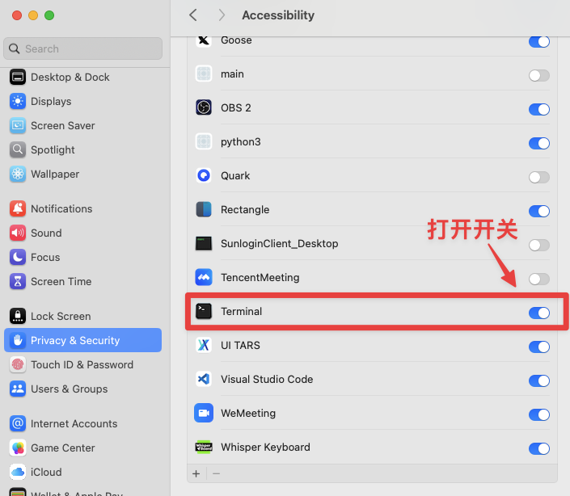

# 🚀 Prompt GO - Instant AI Prompt Access, No Window Required

> A lightweight local prompt management software based on Python, enabling AI text processing from anywhere through global hotkeys

[](https://www.python.org/downloads/)
[](https://opensource.org/licenses/MIT)
[](https://github.com/psf/black)

<div align="center">

[English](README.md) | [中文](README_CN.md)

</div>

## 📖 Project Introduction

Prompt Manager is a local AI tool designed to enhance text processing efficiency. **Users can select text in any application, trigger AI model processing through preset global hotkeys, and output results in real-time to the current cursor position.** No need to switch applications or manually copy-paste, achieving a truly seamless AI collaboration experience.

### ✨ Core Features

- **Global Hotkeys**: `Ctrl+Shift+1/2` one-click trigger, supports arbitrary custom key combinations
- **Smart Text Selection**: Automatically captures currently selected text content
- **Real-time Output**: AI responses stream character by character to cursor position
- **Zero Switching**: No need to leave the current application, maintaining workflow continuity
- **Local Processing**: All processing done locally, protecting privacy and security
- **Flexible Templates**: Uses Markdown format prompt templates with variable substitution support


## 🎬 Demo Showcase

Watch these animated demonstrations to see Prompt GO in action:

### 📝 Content Organization Demo


### 🌐 Translation Demo  


### ⚡ Real-time Processing Demo


## 🚀 Quick Start

### 📋 System Requirements
- **Python**: 3.8 or higher
- **Operating System**: macOS 10.14+, Windows 10+, Linux (Ubuntu 18.04+)

### 🛠️ Mac System Permission Setup

Using this software on macOS requires enabling terminal accessibility permissions:




**Setup Steps:**
1. Open "System Preferences" → "Security & Privacy"
2. Click the "Privacy" tab
3. Select "Accessibility" from the left sidebar
4. Click the lock icon to unlock settings
5. Check the "Terminal" app (or Python app)
6. Restart the program to use normally

### 🛠️ Installation Steps

```bash
# 1. Clone the project
git clone https://github.com/your-username/prompt_go.git
cd prompt_go

# 2. Install dependencies (recommended uv)
uv sync
# or use pip
pip install -r requirements.txt

# 3. Configure API key
cp config/global_config.example.yaml config/global_config.yaml
# Edit config/global_config.yaml and enter your API key (currently only supports deepseek)

# 4. Start the program
uv run python main.py
```

### 🔑 Get API Key

#### Deepseek API
1. Visit [Deepseek Platform](https://platform.deepseek.com/)
2. Register an account and create an API key
3. Configure in `config/global_config.yaml`:

```yaml
api:
  deepseek:
    base_url: https://api.deepseek.com
    key: 'sk-your-deepseek-api-key'
    model: deepseek-chat
```

### 🎯 5-Minute Experience

1. **Start Program**: `uv run python main.py`
2. **Select Text**: Select a piece of text in any application
3. **Trigger AI**: Press `Ctrl+Shift+1` (content organization) or `Ctrl+Shift+2` (translation)
4. **View Results**: AI processing results will automatically insert at cursor position

## 📁 Project Details

### File Structure

```
prompt_go/
├── main.py                      # Main program entry
├── config/
│   ├── global_config.yaml      # Global configuration (API keys, etc.)
│   ├── hotkey_mapping.yaml     # Hotkey mapping
│   └── *.example.yaml          # Configuration templates
├── prompt/                     # Prompt template directory
│   ├── tidy_content.md         # Content organization template
│   └── translate.md            # Translation template
├── modules/                   # Core functionality modules
└── tests/                     # Test suite
```

### Basic Configuration

#### Global Configuration (`config/global_config.yaml`)

```yaml
api:
  deepseek:
    base_url: https://api.deepseek.com
    key: 'sk-your-deepseek-api-key'
    model: deepseek-chat
    max_tokens: 2000
    temperature: 0.7

logging:
  level: INFO
  file: prompt_manager.log
  max_size: 10485760  # 10MB
  backup_count: 5

performance:
  typing_speed: 0.005      # Typing speed (seconds/character)
  hotkey_response_timeout: 0.5
  template_cache_enabled: true
```

#### Hotkey Mapping (`config/hotkey_mapping.yaml`)

```yaml
hotkeys:
  ctrl+shift+1: tidy_content.md        # Content organization
  ctrl+shift+2: translate.md           # Translation function

settings:
  enabled: true
  response_delay: 100  # Response delay (milliseconds)
```

### Template Creation

Create `.md` files in the `prompt/` directory:

```markdown
model: deepseek,deepseek-chat
temperature: 0.3
max_tokens: 2000

---

You are a professional translation assistant. Please translate the following text into English, maintaining the original tone and format:

{{input}}

Please provide accurate, natural translation, paying attention to contextual coherence.
```

## 📄 License

This project is licensed under the MIT License - see the [LICENSE](LICENSE) file for details.

## 🙏 Acknowledgments

Thanks to the following open source projects:
- [pynput](https://github.com/moses-palmer/pynput) - Cross-platform keyboard monitoring
- [pyperclip](https://github.com/asweigart/pyperclip) - Clipboard operations
- [PyYAML](https://github.com/yaml/pyyaml) - YAML parsing
- [pytest](https://github.com/pytest-dev/pytest) - Testing framework
- [uv](https://github.com/astral-sh/uv) - Python package management

---

<div align="center">

**⭐ If this project helps you, please give it a star!**

**🐛 Found an issue?** [Submit Issue](https://github.com/astordu/prompt_go/issues) | **💡 Have suggestions?** [Start Discussion](https://github.com/astordu/prompt_go/discussions)

Made with ❤️ for the AI community

</div>