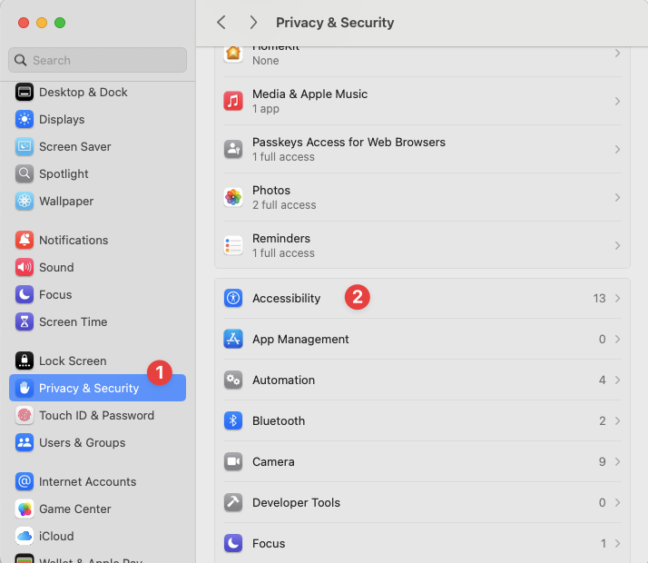
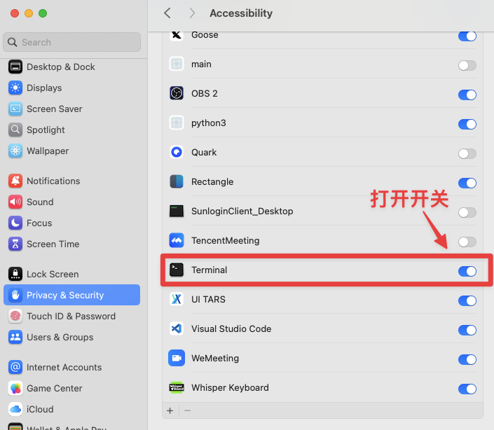

# 🚀 Prompt GO - AI提示词瞬间调用,无需打开窗口

> 一款基于Python的轻量级本地提示词管理软件，通过全局快捷键实现任意位置的AI文本处理

[](https://www.python.org/downloads/)
[](https://opensource.org/licenses/MIT)
[](https://github.com/psf/black)

<div align="center">

[English](README.md) | [中文](README_CN.md)

</div>

## 📖 项目简介

Prompt Manager 是一款专为提升文本处理效率而设计的本地AI工具。**用户可以在任何应用程序中选中文本，通过预设的全局快捷键触发AI模型处理，并将结果实时输出到当前光标位置。** 无需切换应用，无需手动复制粘贴，实现真正的无缝AI协作体验。

### ✨ 核心特性

- **全局快捷键**：`Ctrl+Shift+1/2` 一键触发，支持任意自定义组合键
- **智能选文**：自动获取当前选中的文本内容
- **实时输出**：AI响应逐字符流式输出到光标位置
- **零切换**：无需离开当前应用，保持工作流连续性
- **本地运行**：所有处理在本地完成，保护隐私安全
- **灵活模板**：使用Markdown格式的提示词模板，支持变量替换


## 🎬 功能演示

观看这些动画演示，了解 Prompt GO 的强大功能：

### 📝 内容整理演示


### 🌐 翻译功能演示


### ⚡ mermaid画图


## 🚀 快速上手

### 📋 系统要求
- **Python**: 3.8 或更高版本
- **操作系统**: macOS 10.14+, Windows 10+, Linux (Ubuntu 18.04+)

### 🛠️ Mac系统权限设置

在macOS上使用本软件需要开启终端的辅助功能权限：




**设置步骤：**
1. 打开"系统偏好设置" → "安全性与隐私"
2. 点击"隐私"选项卡
3. 在左侧列表中选择"辅助功能"
4. 点击锁图标解锁设置
5. 勾选"终端"应用（或Python应用）
6. 重启程序即可正常使用

### 🛠️ 安装步骤 

```bash
# 1. 克隆项目
git clone https://github.com/your-username/prompt_go.git
cd prompt_go

# 2. 安装依赖（推荐uv）
uv sync
# 或者使用 pip
pip install -r requirements.txt

# 3. 配置API密钥
cp config/global_config.example.yaml config/global_config.yaml
# 编辑 config/global_config.yaml，填入你的API密钥 (目前只支持deepseek)

# 4. 启动程序
uv run python main.py
```

### 🔑 获取API密钥

#### Deepseek API
1. 访问 [Deepseek平台](https://platform.deepseek.com/)
2. 注册账号并创建API密钥
3. 在 `config/global_config.yaml` 中配置：

```yaml
api:
  deepseek:
    base_url: https://api.deepseek.com
    key: 'sk-your-deepseek-api-key'
    model: deepseek-chat
```

### 🎯 5分钟体验

1. **启动程序**：`uv run python main.py`
2. **选择文本**：在任何应用中选中一段文字
3. **触发AI**：按 `Ctrl+Shift+1`（内容整理）或 `Ctrl+Shift+2`（翻译）
4. **查看结果**：AI处理结果会自动插入到光标位置

## 📁 项目详情

### 文件结构

```
prompt_go/
├── main.py                      # 主程序入口
├── config/
│   ├── global_config.yaml      # 全局配置（API密钥等）
│   ├── hotkey_mapping.yaml     # 快捷键映射
│   └── *.example.yaml          # 配置模板
├── prompt/                     # 提示词模板目录
│   ├── tidy_content.md         # 内容整理模板
│   └── translate.md            # 翻译模板
├── modules/                   # 核心功能模块
└── tests/                     # 测试套件
```

### 基础配置

#### 全局配置 (`config/global_config.yaml`)

```yaml
api:
  deepseek:
    base_url: https://api.deepseek.com
    key: 'sk-your-deepseek-api-key'
    model: deepseek-chat
    max_tokens: 2000
    temperature: 0.7

logging:
  level: INFO
  file: prompt_manager.log
  max_size: 10485760  # 10MB
  backup_count: 5

performance:
  typing_speed: 0.005      # 打字速度（秒/字符）
  hotkey_response_timeout: 0.5
  template_cache_enabled: true
```

#### 快捷键映射 (`config/hotkey_mapping.yaml`)

```yaml
hotkeys:
  ctrl+shift+1: tidy_content.md        # 内容整理
  ctrl+shift+2: translate.md           # 翻译功能

settings:
  enabled: true
  response_delay: 100  # 响应延迟（毫秒）
```

### 模板创建

创建 `.md` 文件在 `prompt/` 目录下：

```markdown
model: deepseek,deepseek-chat
temperature: 0.3
max_tokens: 2000

---

你是一个专业的翻译助手。请将以下文本翻译成英文，保持原文的语气和格式：

{{input}}

请提供准确、自然的翻译，注意上下文的连贯性。
```

## 📄 许可证

本项目采用 MIT 许可证 - 查看 [LICENSE](LICENSE) 文件了解详情。

## 🙏 致谢

感谢以下开源项目：
- [pynput](https://github.com/moses-palmer/pynput) - 跨平台键盘监听
- [pyperclip](https://github.com/asweigart/pyperclip) - 剪贴板操作
- [PyYAML](https://github.com/yaml/pyyaml) - YAML解析
- [pytest](https://github.com/pytest-dev/pytest) - 测试框架
- [uv](https://github.com/astral-sh/uv) - Python包管理

---

<div align="center">

**⭐ 如果这个项目对您有帮助，请给它一个星标！**

**🐛 发现问题？** [提交Issue](https://github.com/astordu/prompt_go/issues) | **💡 有建议？** [开启讨论](https://github.com/astordu/prompt_go/discussions)

Made with ❤️ for the AI community

</div> 